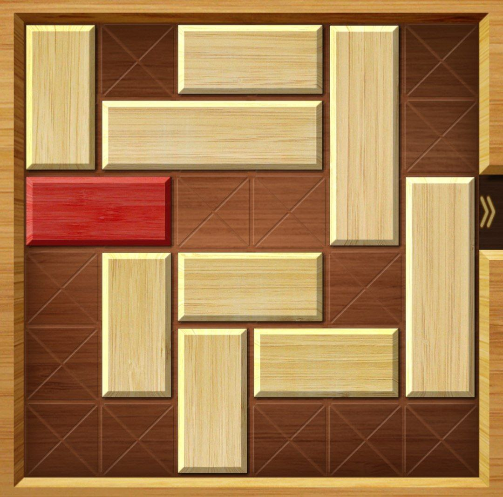
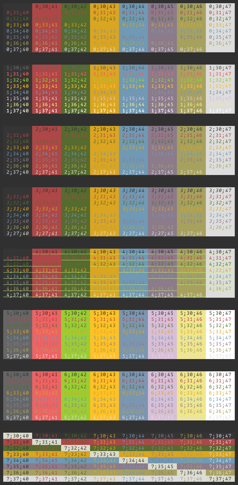
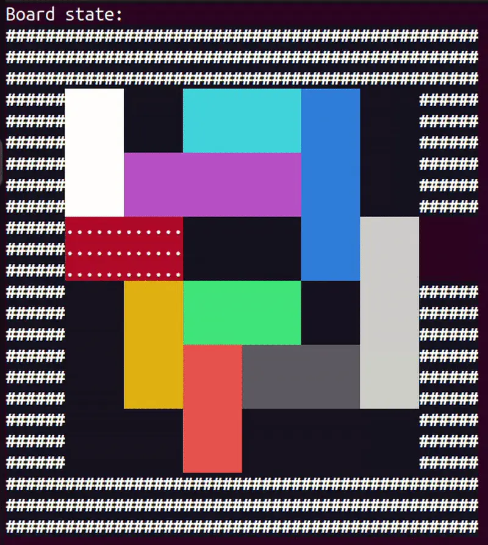

# SlideBlockPuzzle game solver

## 1. Annotation

On the past week, I've been playing game called 'Move the Block' and everything was fine, levels were interesting and not too complicated. But then I've got stuck on one the levels for half an hour, I've tried so hard to find any solution, but didn't succeed. So, as I know basic algorithms I've decided to create simple console solver for this particular case.

## 2. Game description and rules

Here is how the game's board looks like:



*photo from mobile game "Move the Block"*

Goal of the game is to "free" the goal block (or highlighted block, red one), i.e. you need to slide it through the gap (escape gate) on the right side of the board. Blocks can slide only horizontaly or verticaly, along their longer side and of course they can't go through each other or collide in some other way. Score is decided by how many moves you made to solve the puzzle,

## 3. Theory

## 3.1. ANSI escape sequences

### 3.1.1. Colors

I've decided to create a terminal app for this project, but we need to find a way to display blocks somehow. Of course, we can use ASCII graphics[<sup>[1]</sup>](#reference-1) for this, but there's a more beautiful and fancy way. That's to use ANSI escape sequences (or codes). Wiki [**page**](https://en.wikipedia.org/wiki/ANSI_escape_code)[<sup>[2]</sup>](#reference-2) on the topic. Basically, it's just some sequences of bytes, that you output just like any other text in order to control background and font color of the symbols, cursor position and other things in text terminals.

All sequences start with ESC char code. That's **\033** (27 in octal numeral system[<sup>[3]</sup>](#reference-3) ) or **\x1b** (27 in hexadecimal number system). Then '[' symbol is following. After that, there are bytes that vary depending on the command. Description of how one terminal cell (symbol) style is defined:

Following examples I took from stack oveflow [**answer**](https://stackoverflow.com/questions/287871/how-do-i-print-colored-text-to-the-terminal)[<sup>[4]</sup>](#reference-4) on colored text in terminal question.

<details>
<summary>code that generates example table</summary>

```python
for style in range(8):
    for fg in range(30,38):
        s1 = ''
        for bg in range(40,48):
            format = ';'.join([str(style), str(fg), str(bg)])
            s1 += '\x1b[%sm %s \x1b[0m' % (format, format)
        print(s1)
    print('\n')
```
</details>

<details>
<summary>ansi colors table example from stack overflow</summary>



</details>

So, color style looks like this (in classic ANSI 16-colors): "\x1b[styleType;backgroundColorCode;foregroundColorCodem" (note that it ends with a letter 'm').

* styleType can be 0..7. Typical styles:

| style code | usage, type of style                                                                                                                          |
|------------|-----------------------------------------------------------------------------------------------------------------------------------------------|
| 0          | normal style, \x1b[0m is used to remove all applied color styles                                                                              |
| 1          | **bold text** style                                                                                                                               |
| 2          | makes text color dim                                                                                                                          |
| 3          | *cursive (or italian)*                                                                                                                          |
| 4          | <ins>underlined text</ins>                                                                                                                               |
| 5,6        | makes text blink, I think that difference between 5 and 6 is speed of blinking                                                                |
| 7          | inverse style, colors of background and foreground (text color) are swapped. For example, that happens when you select text in your terminal. |

* Background and text color codes. There are 2 groups of color with 8 in each group, first one is normal color and second one is bright. Normal color codes: 40-47, bright color codes: 100-107. Same with text color, but for them all the codes are smaller by 10. Here's table for better understanding:


<table>
    <thead>
        <tr>
            <th style="text-align: center;">Color</th>
            <th style="text-align: center;">Example</th>
            <th style="text-align: center;">Text</th>
            <th style="text-align: center;">Background</th>
            <th style="text-align: center;">Bright Example</th>
            <th style="text-align: center;">Bright Text</th>
            <th style="text-align: center;">Bright Background</th>
        </tr>
    </thead>
    <tbody>
        <tr>
            <td style="text-align: center;">Black</td>
            <td style="text-align: center;"></td>
            <td style="text-align: center;">30</td>
            <td style="text-align: center;">40</td>
            <td style="text-align: center;">
            </td>
            <td style="text-align: center;">90</td>
            <td style="text-align: center;">100</td>
        </tr>
        <tr>
            <td style="text-align: center;">Red</td>
            <td style="text-align: center;"></td>
            <td style="text-align: center;">31</td>
            <td style="text-align: center;">41</td>
            <td style="text-align: center;">
            </td>
            <td style="text-align: center;">91</td>
            <td style="text-align: center;">101</td>
        </tr>
        <tr>
            <td style="text-align: center;">Green</td>
            <td style="text-align: center;"></td>
            <td style="text-align: center;">32</td>
            <td style="text-align: center;">42</td>
            <td style="text-align: center;">
            </td>
            <td style="text-align: center;">92</td>
            <td style="text-align: center;">102</td>
        </tr>
        <tr>
            <td style="text-align: center;">Yellow</td>
            <td style="text-align: center;">
            </td>
            <td style="text-align: center;">33</td>
            <td style="text-align: center;">43</td>
            <td style="text-align: center;">
            </td>
            <td style="text-align: center;">93</td>
            <td style="text-align: center;">103</td>
        </tr>
        <tr>
            <td style="text-align: center;">Blue</td>
            <td style="text-align: center;"></td>
            <td style="text-align: center;">34</td>
            <td style="text-align: center;">44</td>
            <td style="text-align: center;">
            </td>
            <td style="text-align: center;">94</td>
            <td style="text-align: center;">104</td>
        </tr>
        <tr>
            <td style="text-align: center;">Magenta</td>
            <td style="text-align: center;">
            </td>
            <td style="text-align: center;">35</td>
            <td style="text-align: center;">45</td>
            <td style="text-align: center;">
            </td>
            <td style="text-align: center;">95</td>
            <td style="text-align: center;">105</td>
        </tr>
        <tr>
            <td style="text-align: center;">Cyan</td>
            <td style="text-align: center;"></td>
            <td style="text-align: center;">36</td>
            <td style="text-align: center;">46</td>
            <td style="text-align: center;">
            </td>
            <td style="text-align: center;">96</td>
            <td style="text-align: center;">106</td>
        </tr>
        <tr>
            <td style="text-align: center;">White</td>
            <td style="text-align: center;"></td>
            <td style="text-align: center;">37</td>
            <td style="text-align: center;">47</td>
            <td style="text-align: center;">
            </td>
            <td style="text-align: center;">97</td>
            <td style="text-align: center;">107</td>
        </tr>
        <tr>
            <td style="text-align: center;">Default</td>
            <td style="text-align: center;"></td>
            <td style="text-align: center;">39</td>
            <td style="text-align: center;">49</td>
            <td style="text-align: center;"></td>
            <td style="text-align: center;">99</td>
            <td style="text-align: center;">109</td>
        </tr>
        <tr>
            <td style="text-align: center;">Reset</td>
            <td style="text-align: center;"></td>
            <td style="text-align: center;">0</td>
            <td style="text-align: center;">0</td>
            <td style="text-align: center;"></td>
            <td style="text-align: center;">0</td>
            <td style="text-align: center;">0</td>
        </tr>
    </tbody>
</table>


### 3.1.2. Terminal screen management

Terminal screen is represented as 2D matrix, where each cell (symbol) has it's own position (in 1-indexation), cell (1, 1) is located in top left corner. I've used these sequences, to redraw game board with blocks (just a matrix of symbols) really fast. With these sequences, there's no need to perform time consuming clearance of the screen and redrawing matrix all over again, instead I can redraw only those cells that has changed, by moving cursor to that position, substituting new char and returning to old position. This is done by having 2 matrices: old one, where previous board state is stored and new one, with recent changes applied. Such technique is called [**double bufferization**](https://dev.to/alex_ricciardi/double-buffering-ensuring-smooth-animation-and-responsiveness-in-graphics-3l04)[<sup>[5]</sup>](#reference-5) .

Basic terminal control sequences:

| ANSI Escape Sequence      | Description                                                                 |
|---------------------------|-----------------------------------------------------------------------------|
| `\033[H`                  | Move cursor to home position (0, 0)                                         |
| `\033[<row>;<column>H`    | Move cursor to specific row and column (1-based)                            |
| `\033[<n>A`               | Move cursor up by `n` lines                                                 |
| `\033[<n>B`               | Move cursor down by `n` lines                                               |
| `\033[<n>C`               | Move cursor forward by `n` columns                                          |
| `\033[<n>D`               | Move cursor backward by `n` columns                                         |
| `\033[s`                  | Save current cursor position                                                |
| `\033[u`                  | Restore saved cursor position                                               |
| `\033[2J`                 | Clear entire screen (and move cursor to home position)                      |
| `\033[1J`                 | Clear from cursor to beginning of screen                                    |
| `\033[0J`                 | Clear from cursor to end of screen                                          |
| `\033[K`                  | Clear current line from cursor to end                                       |
| `\033[1K`                 | Clear current line from beginning to cursor                                  |
| `\033[2K`                 | Clear entire current line                                                   |
| `\033[<n>S`               | Scroll whole page up by `n` lines                                           |
| `\033[<n>T`               | Scroll whole page down by `n` lines                                         |
| `\033[?25h`               | Show cursor                                                                 |
| `\033[?25l`               | Hide cursor                                                                 |
| `\033[6n`                 | Query cursor position (reports as `\033[<row>;<column>R`)                   |

## 3.2. BFS algorithm

This is a very simple [**algorithm**](https://en.wikipedia.org/wiki/Breadth-first_search)[<sup>[6]</sup>](#reference-6) from graph theory that is used to traverse graphs and it has many different applications, for example other more complex algorithms use it. One of applications is to find minimal distance from some fixed vertex (source or start) to every other vertex in unweighted graph (i.e. all edges have equal weight, say 1). 

<details>
<summary>Pseudo code from wikipedia[<sup>[7]</sup>](#reference-7) </summary>

```
 1  procedure BFS(G, root) is
 2      let Q be a queue
 3      label root as explored
 4      Q.enqueue(root)
 5      while Q is not empty do
 6          v := Q.dequeue()
 7          if v is the goal then
 8              return v
 9          for all edges from v to w in G.adjacentEdges(v) do
10              if w is not labeled as explored then
11                  label w as explored
12                  w.parent := v
13                  Q.enqueue(w)
```
</details>

<details>
<summary>C++ BFS implementation example</summary>

```C++
void findDistanceToAllVertices(
    int                        start,
    vector<int>&               distances,
    const vector<vector<int>>& g
) {
    // fill distances array with INF value
    for (auto& it : distances)
        it = INF; // INF - some big number, that is bigger than any possible distance
    distances[start] = 0; // we begin from start, it's already visited
    queue<int> q;
    q.push(start);

    while (!q.empty()) {
        int cur = q.front();
        q.pop();

        // process all neighbours of current vertex
        for (auto to : g[cur]) {
            // if dist[to] != INF, then it means that TO has already been visited earlier, so this current vertex won't improve minimal distance to TO.
            if (dist[to] == INF) {
                // update minimal distance to vertex TO
                dist[to] = dist[cur] + 1;
                q.push(to);
            }
        }
    }
}
```
</details>

## 4. Board solver algorithm description

### 4.1 Basic description

Algorithm is pretty simple. Each board state is a vertex, each possible move that we can make from it is an edge. There is a starting (initial) board state that we get when we start a new puzzle. And also, some set of final board states. I will call state final, if goal (highlighted, I will use these 2 terms interchangeably) block can escape by just one move, so path from it to the escape gate is free from other blocks. Now, with this new representation of our task, problem is very simple. We need to find minimal distance from starting position to one of the final states. That's just a right task for **BFS** algorithm, which I described earlier.

### 4.2. How to get neighbour board states?

Given a current board state, how to get list of board states, that we can reach by just one move? First, I find list of blocks by iterating through board (again, just 2D matrix of symbols). Then I try to find all reachable boards in case if I move some fixed block. To do so, I move block in one way of its direction as far as I can (while it's inside board and doesn't collide with other blocks) and then in other way. For example, if block is vertical, then it will be moved up and down as far as possible. Current board will be connected by edge with all boards that we get by moving this block.

### 4.3. How to represent board as a vertex?

We need to somehow save for each vertex (board) distance to it and previous move (to restore history of moves for final solution). For that we need associative array, i.e. python [**dict**](https://docs.python.org/3/tutorial/datastructures.html#dictionaries)[<sup>[8]</sup>](#reference-8) structure, which is actually just a hashtable[<sup>[9]</sup>](#reference-9) . For hash function I used python internal functions for hashing, specificaly sha256:

<details>
<summary>hash func for board state</summary>

```python
# transform 2d matrix of symbols into array of bytes
data = dumps(self.board, sort_keys=True).encode("utf-8")
hashBytes = sha256(data).digest()
# we truncate this number to only 64-bit integer
hash = int.from_bytes(hashBytes[:8], byteorder="big")
return hash
```
</details>

## 5. Further improvments

Unfortunately, current algorithm for puzzle solving is very slow (and memory consuming). Even for small puzzles (one on the example photo) it can work up to 10 seconds. Of course, this is python, which is known for not being the fastest language, and maybe I should have written this whole project on C++ in the first place, but I'm planning to return to this project later and create convenient UI design for initial board state input, so that's why I've stayed on python.

### 5.1. BFS improvment

Problem with BFS algorithm is that in graphs like this, where edges and vertices are not stated as somekind of a list, but rather are created implicitly, number of vertices on each layer (how far vertex is from start) increase exponentialy. For example, for level on the picture number of reachable board states is around 14000 which is quite a lot as board is not so big. If we assume that $B$ is number of edges that each vertex has on average, $K$ is distance from start to final state, than BFS traverse $1 + B + B^2 + \ldots + B^{K}$ vertices.

#### 5.1.1. Bidirectional BFS

One of the improvments can be [bidirectional BFS](https://stackoverflow.com/questions/10995699/how-do-you-use-a-bidirectional-bfs-to-find-the-shortest-path)[<sup>[10]</sup>](#reference-10) . Idea is that instead of running "wave" only from start, we can run it both from start and final points simultaneously and check for first point of contact (intersection). This way BFS will traverse only around: $2 + 2B + 2B^2 + \ldots + 2B^{K/2}$, which is significantly better than original BFS algorithm. Unfortunately, I didn't come up with an efficient way to find one of the final states, so I couldn't use this approach in this project.

#### 5.1.2 A* search algorithm

[**A\* algorithm**](https://en.wikipedia.org/wiki/A*_search_algorithm)[<sup>[11]</sup>](#reference-11) has same asymptotics as BFS algorithm, however it usualy performs better due to specific structure of graph on which it is being run. Main idea is that we introduce new heuristic function $h(v)$ that can for each board state say "how far it is from final state" and by combining it with initial distance from start we get some new "cost" of each vertex. On each step we find vertex with the smallest "cost" and update its neighbours. I came with these parameters:

* distance from goal block to the exit gate
* number of blocks that prevent goal block from exiting

Heuristic function can be formed from this 2 values, for example, as their linear combination[<sup>[12]</sup>](#reference-12) . But I didn't believe that this will improve performance much, so I didn't implement it.

### 5.2. Hash function

I think, that it's better to save board state in different, more convenient for speed up way. In stead of saving the whole board as a 2D matrix, we can just save list of blocks that are located on it. Each block is just coordinates of top left corner, orientation (horizontal or vertical) and length. Also, it's easier to use custom hash function, it will not be as safe as sha256, but it will be faster. And as a bonus we can choose it in such a way that there is no need to recalculate the whole board after only one piece moved. I.e. it will hash multisets of blocks, so their order won't matter. By doing this, we can recalculate board's hash really fast. So now, we can find board's neighbours just in $O(N^2)$, instead of $O(W \cdot H)$, where $N, W, H$ are number of blocks on board, board's width and height accordingly.

## 6. Solving algorithm working process

Goal is to move red block (with white dots) through the escape gate on the right. Each move that player has to do in order to win is displayed with simple "animation": on each move, block, which is about to change position is blinking few times.



## 7. How to run and input?

To run puzzle solver just run this command in terminal:

```bash
python3 main.py
```

Python3.11+ is needed because I've used **StrEnum** for input prompts and error messages, apart from that I think python3.10 should be enough, as I didn't use any other fancy constructions.

## 7.1 How to input board state?

Unfortunately, it's not as convenient as I would like it to be, but I've tried to make the best I possible could. Input format is already described in detail via helper messages in terminal, that are shown during script working process, so I will mention only the most important things.

Steps of puzzle solver:

1. First you need to specify how your board looks like: width, height and where is escape gate located (hole, through which highligted block needs to exit). Escape gate location is specified with 2 things: side type (top, right, bottom, left) and where on this side it's located.
2. After you have inputed board configuration, script will show how board looks like and ask for your configuration. If you made a mistake, than you can print no (actually, anything apart from "yes") and input process will be repeated
3. Then, you need to specify blocks that are in your puzzle. After each block is inputed board image will change accordingly. Each block inputed by specifying: top left corner (2 coordinates, x and y), orientation ('h' for horizontal and 'v' for vertical), sideLen (length of longer side of block, short one is always equal to 1). Notes:
    * you can undo previously added block with "undo" command
    * to stop inputing blocks, input Enter
4. After you've inputed all blocks. Script will start searching for solution, that may take some time (around 5-15 seconds), so you have to wait. After that it will tell you how many moves there are in the most optimal solution.
5. When you hit enter, you just need to watch carefully how blocks are moving and repeat it in your puzzle.


## References


<a id="reference-1"></a>
1. [**^**](https://en.wikipedia.org/wiki/ASCII_art) ASCII art, wiki page.
<a id="reference-2"></a>
2. [**^**](https://en.wikipedia.org/wiki/ANSI_escape_code) ANSI escape codes, wiki page.
<a id="reference-3"></a>
3. [**^**](https://en.wikipedia.org/wiki/Numeral_system) Numeral systems.
<a id="reference-4"></a>
4. [**^**](https://stackoverflow.com/questions/287871/how-do-i-print-colored-text-to-the-terminal) How to print colored text in terminal, stack overflow question.
<a id="reference-5"></a>
5. [**^**](https://dev.to/alex_ricciardi/double-buffering-ensuring-smooth-animation-and-responsiveness-in-graphics-3l04) Double buffering technique.
<a id="reference-6"></a>
6. [**^**](https://en.wikipedia.org/wiki/Breadth-first_search) BFS algorithm.
<a id="reference-7"></a>
7. [**^**](https://en.wikipedia.org/wiki/Breadth-first_search#Pseudocode) BFS algorithm pseudocode.
<a id="reference-8"></a>
8. [**^**](https://docs.python.org/3/tutorial/datastructures.html#dictionaries) Python dictionary structure.
<a id="reference-9"></a>
9. [**^**](https://en.wikipedia.org/wiki/Hash_table) Hash table.
<a id="reference-10"></a>
10. [**^**](https://stackoverflow.com/questions/10995699/how-do-you-use-a-bidirectional-bfs-to-find-the-shortest-path) Bidirectional BFS description.
<a id="reference-11"></a>
11. [**^**](https://en.wikipedia.org/wiki/A*_search_algorithm) A* search algorithm.
<a id="reference-12"></a>
12. [**^**](https://en.wikipedia.org/wiki/Linear_combination) Linear combination.
